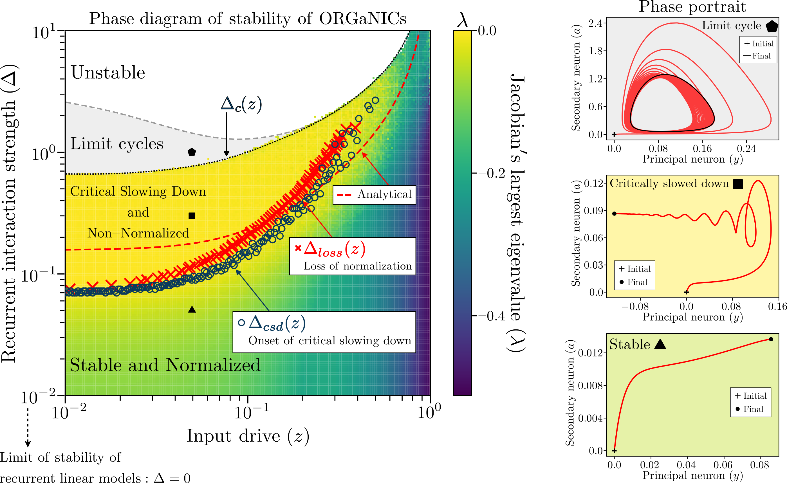

# Stabilization of recurrent neural networks through divisive normalization

<div style="text-align: center;">

</div>

## Overview

Stability is a fundamental requirement for both biological and engineered neural circuits, yet it is surprisingly difficult to guarantee in the presence of recurrent interactions. Standard linear dynamical models of recurrent networks are unreasonably sensitive to the precise values of the synaptic weights, since stability requires all eigenvalues of the recurrent matrix to lie within the unit circle. Here we demonstrate, both theoretically and numerically, that an arbitrary recurrent neural network can remain stable even when its spectral radius exceeds 1, provided it incorporates divisive normalization, a dynamical neural operation that suppresses the responses of individual neurons. Sufficiently strong recurrent weights lead to instability, but the approach to the unstable phase is preceded by a regime of critical slowing down, a well-known early warning signal for loss of stability. Remarkably, the onset of critical slowing down coincides with the breakdown of normalization, which we predict analytically as a function of the synaptic strength and the magnitude of the external input. Our findings suggest that the widespread implementation of normalization across neural systems may derive not only from its computational role, but also to enhance dynamical stability.

## Installation

Follow these steps:

1. Clone the repository:
    ```bash
    git clone https://github.com/shivangrawat/perturbed_organics.git
    cd perturbed_organics
    ```
2. Add the current directory to your Python path:
    ```bash
    export PYTHONPATH=$(pwd):$PYTHONPATH
    ```

## Repository Structure

The repository is organized as follows:

* `perturbed_organics/`: Main package directory.
    * `model/ORGaNICs_models/`: Contains the core implementation of the ORGaNICs models, such as `ORGaNICs.py`, `ORGaNICs2D.py`, and `ORGaNICs3D.py`.
    * `simulation_scripts/`: Scripts used to run the simulations presented in the paper, for example, `scan_stable.py` and `scan_stable_adaptive.py`.
    * `spectrum_general/`: Python modules for spectral analysis of matrices and dynamical systems.
    * `utils/`: Utility functions and classes supporting the simulations and analyses.
* `examples/`: Jupyter notebooks used to generate figures and perform analyses for the paper. This includes notebooks like `phase_eigval_norm_delocalized.ipynb`, `trajectories.ipynb`, and `eigval_histogram.ipynb`.
* `slurm_jobs/`: Scripts for generating and managing SLURM job submissions for running experiments on a high-performance computing cluster (e.g., `slurm_script_gen_phase_diagram.py`).

## Reference and Citation

> *Stabilization of recurrent neural networks through divisive normalization*
> 
> Flaviano Morone*, Shivang Rawat*, David J. Heeger and Stefano Martiniani
>
> https://proceedings.neurips.cc/paper_files/paper/2024/file/1abed6ee581b9ceb4e2ddf37822c7fcb-Paper-Conference.pdf

```bibtex
@article{rawat2025unconditional,
  title={Unconditional stability of a recurrent neural circuit implementing divisive normalization},
  author={Rawat, Shivang and Heeger, David and Martiniani, Stefano},
  journal={Advances in Neural Information Processing Systems},
  volume={37},
  pages={14712--14750},
  year={2025}
}
```
